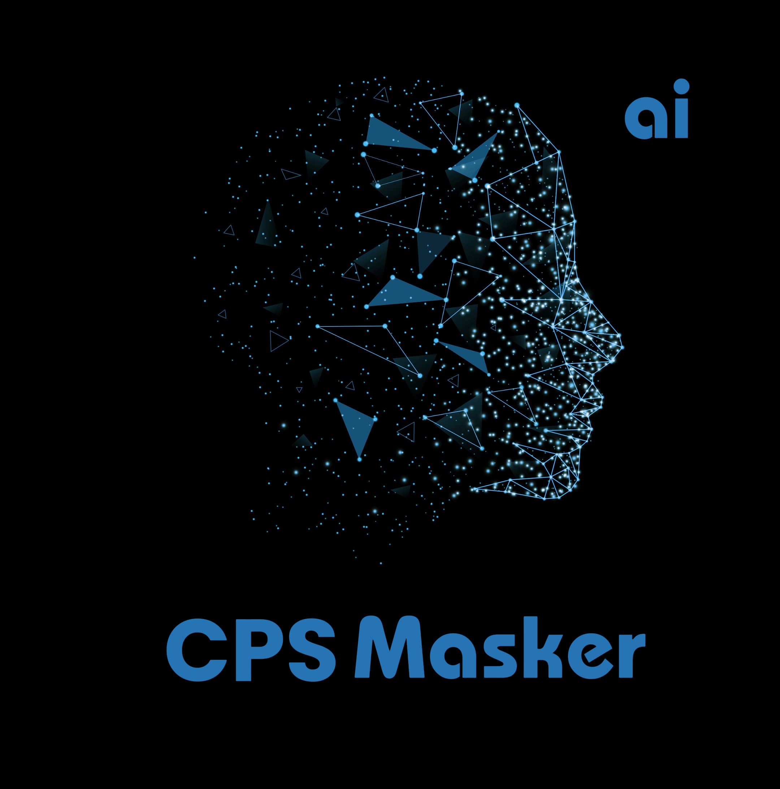

<h1 align="center">CPS Masker</h1>

<p align="center">
  CPS Masker menghadirkan teknologi masker  wajah secara real-time. Memanfaatkan kecerdasan buatan, ciptakan efek visual mutakhir dengan mulus dalam hitungan detik.
</p>

<p align="center">
  
</p>

##  Disclaimer

Perangkat lunak CPS Masker ini dirancang sebagai alat produktif untuk industri media yang dihasilkan oleh AI. Perangkat ini dapat membantu seniman dalam menganimasikan karakter kustom, menciptakan konten yang menarik, dan bahkan menggunakan model untuk desain pakaian.

Kami menyadari potensi penyalahgunaan dan berkomitmen pada langkah-langkah pencegahan. Sistem pemeriksaan bawaan mencegah perangkat lunak memproses media yang tidak pantas (konten telanjang, grafis, atau materi sensitif seperti rekaman perang, dll.). Kami akan terus mengembangkan proyek ini secara bertanggung jawab, mematuhi hukum dan etika. Jika diwajibkan secara hukum, kami dapat menghentikan proyek atau menambahkan tanda air pada hasil output.

- Penggunaan Etis: Pengguna diharapkan menggunakan CPS Masker secara bertanggung jawab dan sesuai hukum. Jika menggunakan wajah orang sungguhan, dapatkan persetujuan mereka dan beri label jelas bahwa hasilnya adalah CPS Masker saat membagikannya secara daring.

- Pembatasan Konten: Perangkat lunak ini dilengkapi dengan pemeriksaan bawaan untuk mencegah pemrosesan media yang tidak pantas, seperti konten telanjang, grafis, atau materi sensitif.

- Kepatuhan Hukum: Kami mematuhi semua hukum dan pedoman etika yang relevan. Jika diwajibkan secara hukum, kami dapat menghentikan proyek atau menambahkan tanda air pada hasil output.

- Tanggung Jawab Pengguna: Kami tidak bertanggung jawab atas tindakan pengguna akhir. Pengguna harus memastikan penggunaan perangkat lunak ini selaras dengan standar etika dan persyaratan hukum.

Dengan menggunakan perangkat lunak ini, Anda setuju dengan ketentuan ini dan berkomitmen untuk menggunakannya dengan cara yang menghormati hak dan martabat orang lain.

Pengguna diharapkan menggunakan CPS Masker secara bertanggung jawab dan sesuai hukum. Jika menggunakan wajah orang sungguhan, dapatkan persetujuan mereka dan beri label jelas bahwa hasilnya adalah CPS Masker saat membagikannya secara daring. Kami tidak bertanggung jawab atas tindakan pengguna akhir.

## Dependensi

- Python 3.8 atau lebih tinggi
- CUDA 11.0+ dan cuDNN (jika menggunakan GPU NVIDIA)
- FFmpeg untuk pemrosesan video
- Paket Python: `numpy`, `opencv-python`, `onnx`, `onnxruntime-gpu` (atau CPU), `pyqt5`

## Penginstalan

**1. Kloning Repositori**

Klon repositori CPS Masker ke mesin lokal Anda:

```bash
git clone https://github.com/doaibu0000000/CPS-Masker.git
cd CPS-Masker
```

**2. Buat Lingkungan Virtual**

Buat dan aktifkan lingkungan virtual Python untuk mengisolasi dependensi:

```bash
python -m venv venv
source venv/bin/activate  # Linux
venv\Scripts\activate     # Windows
```

**3. Instal Dependensi**

Instal semua dependensi yang diperlukan menggunakan pip:

```bash
pip install -r requirements.txt
```
Jika file `requirements.txt` tidak tersedia, instal paket secara manual:

```bash
pip install numpy opencv-python onnx onnxruntime-gpu pyqt5
```
**4. Instal FFmpeg**

- **Windows**: Unduh FFmpeg dari situs resmi (https://ffmpeg.org/download.html) dan tambahkan ke variabel lingkungan PATH.

- **Linux**: Instal FFmpeg menggunakan manajer paket:

```bash
sudo apt-get install ffmpeg
```
**5. Jalankan CPS Masker**

Jalankan aplikasi utama:

```bash
python main.py
```

Atau, jika menggunakan antarmuka grafis:

```bash
python app_cps/CPSMasker.py
```
